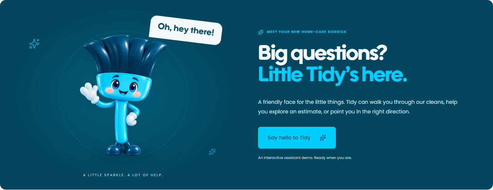

# TidyUp! Midland

A polished, English-language residential cleaning website concept built with **Next.js 16, React 19, TypeScript, and Tailwind CSS 4**. Designed for straightforward deployment on Vercel.



## Run locally

Requires Node.js 22.13 or newer.

```bash
npm ci
npm run dev
```

Open http://localhost:3000.

```bash
npm run typecheck
npm run build
npm start
```

## Deploy to Vercel

1. Import `joaosilvestrim-cloud/tidyup` from GitHub into Vercel.
2. Select the `main` branch and the repository root (`./`).
3. Keep the **Next.js** framework preset and default build/output settings.
4. Deploy. No environment variables, database, or API key are required for this demo.

`vercel.json` identifies the framework. The project uses standard `next dev`, `next build`, and `next start` commands. It has no Sites, Vinext, or Cloudflare runtime dependency.

## Experience

- Responsive editorial layout with the original TidyUp! deep blue (#03465E), cyan (#02CDFF), white, and light gray palette.
- Poppins and the original Utendo Bold, self-hosted through `next/font`.
- Optimized images using `next/image`.
- Standard, Deep, and Moving Cleaning service cards and a detailed comparison.
- Three-step estimate flow with room selectors, service selection, contact validation, and an editable result.
- Accessible mobile navigation and assistant dialogs with keyboard controls.
- **Tidy**, a cyan and navy broom mascot inspired by the original TidyUp! logo, with floating motion, cursor-driven perspective, a thinking state, and a happy response animation.
- Gentle scroll reveals, image interactions, orbiting accents, and micro-interactions.
- Reduced-motion support; animations and perspective effects switch off when requested by the visitor’s system preference.
- Service information, FAQs, local contact details, and a testimonial layout preview.

The mascot is a generated 3D-rendered PNG animated with CSS and pointer interaction. It creates an interactive sense of depth; it is not a rigged WebGL character or a literal four-dimensional simulation.

## Demo boundaries

This repository is a **website prototype**, not a live booking system.

- Prices are illustrative and do not represent TidyUp!’s approved rate card.
- Contact fields remain only in React memory. Nothing is transmitted, persisted, or emailed. Use fictional data while evaluating the prototype.
- Tidy provides local, rule-based demonstration replies. It is not connected to a language model, CRM, calendar, or human operator.
- Chat history remains only in memory, can be reset, and is cleared on reload.
- Testimonials are clearly labeled sample copy. No fabricated rating, review count, customer identity, or business metric is presented as real.
- Phone and email links open the visitor’s communication app. They do not automatically send messages.
- `robots` metadata is deliberately set to `noindex, nofollow` until the concept, pricing, reviews, and production integrations are approved.

### Sample estimate formula

Base amount: `80 + 20 × bedrooms + 25 × bathrooms`.

Multipliers: Standard `1`, Deep `1.65`, Moving `2.1`. The lower estimate is rounded to the nearest $5; the upper estimate is 20% higher, also rounded to $5.

Example: 3 bedrooms + 2 bathrooms, Deep Cleaning = **$315–$380 USD** per visit.

## Before commercial launch

1. Approve the company’s service scope, official pricing, and coverage.
2. Replace sample testimonials with authorized, verifiable customer reviews.
3. Connect the estimate form to a server-validated CRM or email workflow, with privacy disclosures, spam protection, and explicit failure handling.
4. Connect the assistant to an approved AI provider or support service if real AI is needed; keep secrets on the server.
5. Configure the production domain, canonical URL, sitemap, and appropriate business structured data. Remove `noindex` only when the content and integrations are ready.

## Project structure

```text
app/page.tsx                  Page sections and server-rendered content
app/layout.tsx                Fonts, English language, metadata
app/globals.css               Responsive visual system and motion
components/header.tsx        Desktop and mobile navigation
components/quote-calculator.tsx  Estimate wizard and service selection
components/assistant.tsx     Tidy chat, replies, and conversation state
components/motion.tsx        Scroll reveals and mascot perspective/motion
lib/content.ts               Services, comparison, FAQs, sample pricing
public/tidy-mascot-broom.png Current broom mascot with transparency
public/favicon.svg           Brand-specific icon
```

## References and asset provenance

Company information and service checklists were reviewed on October 1, 2026:

- [TidyUp! Midland](https://tidyupmidland.com/)
- [Standard Cleaning](https://tidyupmidland.com/standard-cleaning/)
- [Deep Cleaning](https://tidyupmidland.com/deep-cleaning/)
- [Moving Cleaning](https://tidyupmidland.com/movingcleaning/)
- [Vella Clean](https://vellaclean.com/) — user-supplied reference for the service-selection experience; the implementation and visual design here are original.

See [ASSETS.md](ASSETS.md) for photography attribution and the original mascot generation prompt.

## Verification

Verified before handoff:

- `npm run build`: successful optimized production build, static home page.
- TypeScript: no errors.
- Chromium at 320, 390, 768, and 1440 px: no page overflow; required fields, invalid phone input, expected estimate, edit flow, service selection, comparison table, mobile navigation, and chat all passed.
- Mascot perspective responds to pointer movement; floating animation runs and stops under reduced motion.
- Dark system preference and text enlarged to 200%: no page overflow.
- No browser runtime or console errors in the tested flows.

Browser viewport tests do not substitute for physical iOS/Safari testing. Vercel deployment itself is left to the repository owner.
